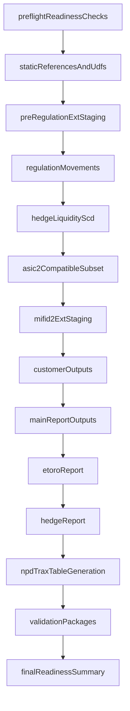

# Workflow Orchestration Plan (Step 17B)

## Staging-only RegTechOps scope

Jobs and workflows defined here are **staging-only RegTechOps jobs** for `main.regtech_ops_stg`. They are **not production-grade** and must not create or overwrite `main.regtech` objects. Data Engineering will later use them as implementation input and adapt them to production criteria.

| Setting | Value |
| --- | --- |
| Read sources | `main.regtech` (and other catalogs) when DE-migrated sources are available |
| Write target | `main.regtech_ops_stg` |
| Generated prefix | `bi_output_regtechops_` |
| Seed prefix | `bi_output_regtechops_seed_` |

## Recommended format

Use a Databricks Asset Bundle YAML skeleton:

- `databricks/workflows/mifid_phase1_table_generation.yml`

This format expresses ordered task dependencies and parameterized run modes for **staging smoke-test and validation** orchestration.

## Execution posture

- **Staging smoke-test / seed-load runs** are permitted under `development_structural_test` when scoped to `main.regtech_ops_stg`.
- **Final-parity and production-schedule deployment** remain blocked until blockers and MAG gates close (`docs/open_blockers_for_execution.md`, `docs/execution_prerequisites.md`).
- Step 17B YAML and SQL wrappers are staging orchestration templates — not production-grade orchestration.

NOC and old Databricks attempt materials remain reference-only.

## Task graph

## Dependency chain by module group

- Preflight checks gate all downstream groups.
- Static/UDF checks gate pre-regulation and output normalization.
- Pre-regulation gates regulation movements and report dependency branches.
- Hedge liquidity gates hedge and parity-sensitive report branches.
- ASIC2 compatibility gates ETORO and certain report paths.
- `MIFID2_ext` gates customer/reg-change/output families.
- Customer outputs gate report family and NPD_TRAX downstream quality.
- Validation packages gate final readiness summary.

## SQL reference strategy

Workflow tasks reference:

- Existing module SQL as placeholders by scope comments in YAML.
- Step 17B gate wrappers for explicit readiness checks:
  - `databricks/sql/10_workflow/gates/gate_global_scope.sql`
  - `databricks/sql/10_workflow/gates/gate_module_validation_chain.sql`
  - `databricks/sql/10_workflow/gates/gate_cross_module_readiness.sql`

No existing business SQL is modified by Step 17B.

## Validation linkage

- Module validation references remain under:
  - `databricks/sql/validation/`
  - `databricks/sql/03_pre_regulation_ext/*validation*`
  - `databricks/sql/04_regulation_movements/*validation*`
  - `databricks/sql/05_hedge_liquidity/*validation*`
  - `databricks/sql/06_asic2_subset/*validation*`
  - `databricks/sql/07_mifid2_ext/*validation*`
  - `databricks/sql/08_outputs/*validation*`
- Cross-module readiness references remain under:
  - `databricks/sql/09_validation/07_phase1_readiness_summary.sql`
  - `databricks/sql/09_validation/08_cross_module_validation_manifest.sql`
  - `databricks/sql/09_validation/09_cross_module_dependency_gate_checks.sql`

## Explicit exclusions

- Regulatory CSV export/delivery (TRAX paths)
- 7z compression
- SFTP delivery
- Cappitech/TRAX upload
- TRAX response handling
- Writes to `main.regtech`
- Production-grade schedules and production deployment claims

## Explicit inclusions (staging)

- Staging job/workflow skeletons and smoke-test tasks
- Approved CSV **seed** loads into `bi_output_regtechops_seed_*` tables (secure storage; not Git)
- Initial feasible seed test: `MIFID2_NPD_TRAX` (staging validation only)
